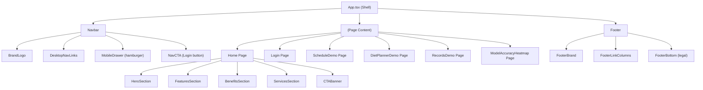
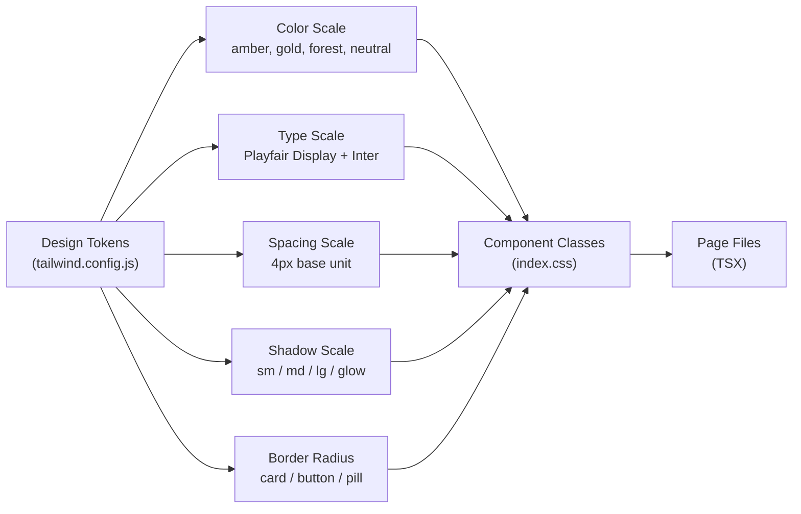
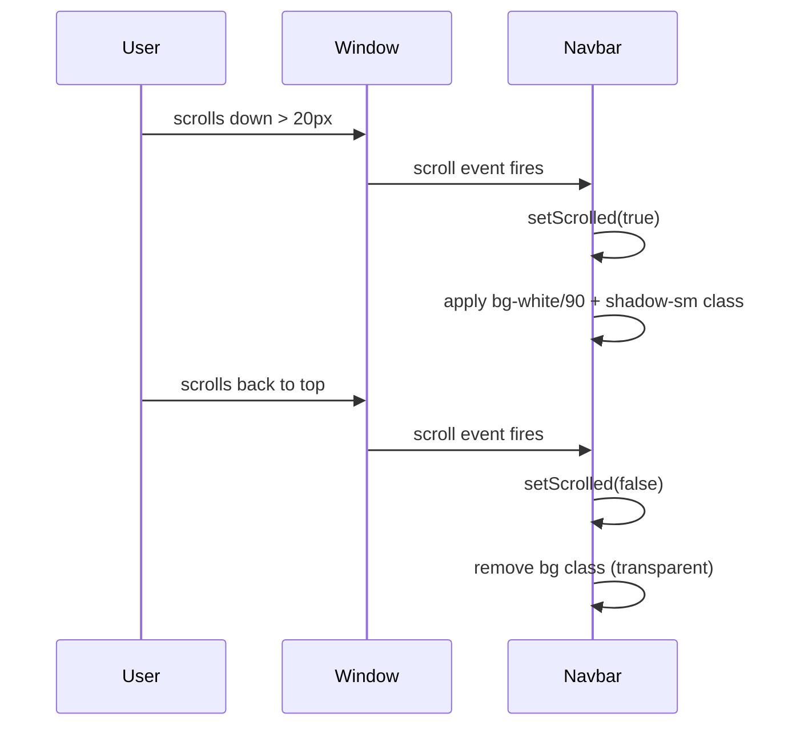

# Design Document: Professional UI Redesign — AyurSutra

## Overview

AyurSutra is a Panchakarma Patient Management & Therapy Scheduling web app built with React, TypeScript, Tailwind CSS, and Vite. The current UI has a functional foundation but lacks the visual polish expected of a premium healthcare SaaS product. This redesign elevates every surface — navigation, hero, cards, forms, tables, and footer — into a cohesive, high-end design system while preserving all existing functionality and routing.

The redesign targets three audiences simultaneously: Ayurvedic practitioners who need a trustworthy clinical tool, patients who expect a calm and reassuring interface, and administrators who need data-dense views to remain readable and efficient. The visual language draws from luxury wellness brands and modern healthcare SaaS (think Headspace meets Figma's design system), anchored in a richer amber/gold palette with deep forest-green accents, generous whitespace, and refined typography.

## Architecture

### Component Hierarchy



### Design Token Architecture

All visual decisions flow from a single source of truth in `tailwind.config.js` and `index.css`. No hardcoded hex values in component files.



## Design System

### Color Palette

| Token | Value | Usage |
|---|---|---|
| `amber-50` | `#fffbf0` | Page background tint |
| `amber-100` | `#fef3c7` | Card backgrounds, section fills |
| `amber-300` | `#fcd34d` | Hero accent text |
| `amber-500` | `#f59e0b` | Icon fills, stat badges |
| `amber-700` | `#b45309` | Primary button base |
| `amber-800` | `#92400e` | Brand text, headings |
| `amber-900` | `#78350f` | Dark brand, footer bg |
| `gold-400` | `#d4a843` | Premium accent, hover glows |
| `forest-600` | `#166534` | Success states, "book" CTAs |
| `forest-700` | `#15803d` | Forest hover |
| `neutral-50` | `#fafaf8` | Body background |
| `neutral-900` | `#1a1a1a` | Body text |
| `neutral-600` | `#4b5563` | Secondary text |
| `neutral-300` | `#d1d5db` | Borders, dividers |

The existing `brand` color in `tailwind.config.js` (green `#0f7b4d`) is repurposed as `forest` and the amber scale becomes the primary brand palette.

### Typography

| Role | Font | Weight | Size |
|---|---|---|---|
| Display / Hero H1 | Playfair Display | 700 | `text-5xl` → `text-7xl` |
| Section H2 | Playfair Display | 600 | `text-3xl` → `text-4xl` |
| Card H3 | Inter | 600 | `text-lg` → `text-xl` |
| Body | Inter | 400 | `text-base` (16px) |
| Caption / Label | Inter | 500 | `text-sm` (14px) |
| Micro / Badge | Inter | 600 | `text-xs` (12px), `tracking-widest` |

Add `Cormorant Garamond` as an optional display font for the hero tagline to add luxury feel (loaded via Google Fonts alongside Playfair Display).

### Spacing System

All spacing uses multiples of 4px (Tailwind's default). Key layout values:

- Section vertical padding: `py-24` (96px)
- Card internal padding: `p-8` (32px)
- Grid gap: `gap-8` (32px)
- Container max-width: `max-w-7xl` (1280px) with `px-6` gutters

### Shadow Scale

```css
/* index.css additions */
.shadow-card   { box-shadow: 0 1px 3px rgba(0,0,0,0.04), 0 8px 24px rgba(0,0,0,0.06); }
.shadow-card-hover { box-shadow: 0 4px 12px rgba(0,0,0,0.08), 0 20px 40px rgba(0,0,0,0.10); }
.shadow-glow-amber { box-shadow: 0 0 0 3px rgba(196,134,46,0.15), 0 8px 24px rgba(139,94,42,0.20); }
.shadow-glow-forest { box-shadow: 0 0 0 3px rgba(22,101,52,0.15), 0 8px 24px rgba(21,128,61,0.20); }
```

## Components and Interfaces

### Navbar

**Purpose**: Sticky top navigation with transparent-to-frosted-glass scroll behavior, mobile hamburger drawer, and active link states.

**Interface**:
```typescript
interface NavbarProps {
  // No props — reads router location internally
}

interface NavLink {
  label: string
  href: string        // anchor (#features) or route (/login)
  isRoute: boolean    // true → use <Link>, false → use <a>
}
```

**Responsibilities**:
- Transparent background at top of page, transitions to `bg-white/90 backdrop-blur-lg` on scroll (via `useEffect` + `scrollY` listener)
- Desktop: horizontal link row with animated underline on active/hover
- Mobile: hamburger icon (3 lines → X) that opens a full-height slide-in drawer from the right
- Active route highlighted with `text-amber-800 font-semibold` and a 2px amber underline
- Login CTA button always visible in nav

**Scroll Behavior**:


### HeroSection

**Purpose**: Full-viewport hero with layered background, animated headline, trust badges, and dual CTAs.

**Interface**:
```typescript
interface HeroSectionProps {
  // Static content — no props needed
}
```

**Visual Layers** (bottom to top):
1. Unsplash background image (existing URL, `object-cover`)
2. Multi-stop gradient overlay: `from-black/80 via-amber-950/60 to-transparent`
3. Decorative SVG mandala pattern (subtle, `opacity-5`) — replaces the plain radial dot pattern
4. Animated amber orb blur (`blur-3xl`, `animate-pulse` at slow speed)
5. Content: badge → H1 → subtext → CTAs → trust stats row

**Trust Stats Row** (new addition below CTAs):
```typescript
const trustStats = [
  { value: '500+', label: 'Ayurvedic Centers' },
  { value: '94%', label: 'Therapy Accuracy' },
  { value: '40%', label: 'Less Admin Work' },
  { value: '4.9★', label: 'Practitioner Rating' },
]
```
Rendered as a horizontal row of stat pills with a subtle divider between them, sitting on a `bg-white/10 backdrop-blur-sm` frosted bar.

### FeatureCard

**Purpose**: Reusable card for features, benefits, and services sections.

**Interface**:
```typescript
interface FeatureCardProps {
  icon: string | React.ReactNode   // emoji or SVG icon component
  title: string
  description: string
  variant?: 'default' | 'gradient' | 'dark'
  accentColor?: 'amber' | 'forest' | 'blue'
  link?: { href: string; label: string }
  badge?: string
}
```

**Responsibilities**:
- `default`: white background, `shadow-card`, hover lifts with `shadow-card-hover`
- `gradient`: colored gradient background (amber/green/blue) for services section
- `dark`: dark amber background for inverted sections
- Icon rendered in a 48×48 rounded square with tinted background (`bg-amber-100` for amber variant)
- Smooth `transition-all duration-300` on hover: `translateY(-4px)` + shadow upgrade
- Optional badge (e.g. "New", "Popular") in top-right corner

### FormField

**Purpose**: Consistent styled input, select, and textarea wrapper used across Login, ScheduleDemo, DietPlannerDemo.

**Interface**:
```typescript
interface FormFieldProps {
  id: string
  label: string
  type?: 'text' | 'email' | 'password' | 'number' | 'date' | 'time' | 'select' | 'textarea'
  value: string | number
  onChange: (value: string) => void
  placeholder?: string
  required?: boolean
  options?: { value: string; label: string }[]  // for select type
  rows?: number                                  // for textarea
  hint?: string                                  // helper text below field
  error?: string                                 // validation error
}
```

**Visual Spec**:
- Label: `text-sm font-medium text-neutral-700`, `mb-1.5`
- Input base: `w-full rounded-xl border border-neutral-200 bg-white px-4 py-3 text-sm text-neutral-900`
- Focus ring: `focus:outline-none focus:ring-2 focus:ring-amber-500/30 focus:border-amber-500`
- Error state: `border-red-400 focus:ring-red-400/30`
- Transition: `transition-colors duration-150`
- Hint text: `text-xs text-neutral-500 mt-1`

### LoginPage

**Purpose**: Centered auth card with premium visual treatment.

**Layout**:
- Full-viewport split: left panel (decorative, amber gradient + brand messaging) + right panel (form) on desktop
- Single centered card on mobile
- Left panel content: large serif quote about Ayurveda, decorative leaf SVG, trust badges
- Right panel: logo mark, "Welcome back" heading, form, forgot password link, terms note

**Form Fields**: Email, Password (with show/hide toggle eye icon)

**Button**: Full-width `btn-primary` with loading spinner state

### RecordsDemo

**Purpose**: Data table with search, add mock, and row hover states.

**Enhancements**:
- Table header: `bg-amber-50` instead of `bg-gray-50`, amber-tinted column labels
- Row hover: `hover:bg-amber-50/50` with smooth transition
- Record ID: styled as a monospace pill badge (`bg-neutral-100 rounded-md px-2 py-0.5`)
- Therapy name: colored dot indicator (amber for Shirodhara, green for Abhyanga, etc.)
- Search input: upgraded to `FormField` style with search icon prefix
- "Add mock" button: `btn-outline-amber` style (amber border, amber text, white bg)
- Empty state: illustrated empty state with icon and descriptive text

### ScheduleDemo & DietPlannerDemo

**Enhancements**:
- Panel headers: amber gradient top border (`border-t-4 border-amber-500`)
- Dosha prediction card: richer styling with dosha color coding (Vata=blue, Pitta=red, Kapha=green)
- Confidence bars: animated progress bars replacing plain text percentages
- "Book This Therapy" button: upgraded to `btn-forest` (green CTA)
- Booking confirmation: green success panel with checkmark icon and confetti-like border

### Footer

**Purpose**: Multi-column structured footer replacing the minimal 2-item footer.

**Interface**:
```typescript
interface FooterColumn {
  heading: string
  links: { label: string; href: string }[]
}

const footerColumns: FooterColumn[] = [
  { heading: 'Product', links: [Features, Pricing, Demo, Changelog] },
  { heading: 'Resources', links: [Documentation, Blog, Case Studies, API] },
  { heading: 'Company', links: [About, Careers, Press, Contact] },
  { heading: 'Legal', links: [Privacy, Terms, Security, Cookies] },
]
```

**Layout**:
- Dark amber background (`bg-amber-950`) with warm off-white text
- Top row: brand logo + tagline (left) + newsletter signup (right)
- Middle row: 4-column link grid
- Bottom row: copyright + social icons (Twitter/X, LinkedIn, GitHub)
- Thin amber gradient top border

## Data Models

### Design Token Types

```typescript
type ColorVariant = 'amber' | 'forest' | 'blue' | 'neutral'
type SizeVariant = 'sm' | 'md' | 'lg'
type ButtonVariant = 'primary' | 'outline' | 'ghost' | 'forest'

interface ThemeConfig {
  primaryColor: ColorVariant
  fontSerif: string
  fontSans: string
  borderRadius: Record<SizeVariant, string>
}
```

### Navigation State

```typescript
interface NavState {
  isScrolled: boolean       // triggers frosted glass effect
  isMobileOpen: boolean     // controls hamburger drawer
  activeRoute: string       // current pathname for active link styling
}
```

### Animation Config

```typescript
interface AnimationConfig {
  duration: number          // ms
  easing: string            // CSS easing function
  delay?: number            // stagger delay for lists
}

const cardHoverAnimation: AnimationConfig = {
  duration: 300,
  easing: 'cubic-bezier(0.4, 0, 0.2, 1)',
}

const heroFadeIn: AnimationConfig = {
  duration: 800,
  easing: 'ease-out',
  delay: 150,               // stagger per element
}
```

## Algorithmic Pseudocode

### Navbar Scroll Behavior

```pascal
PROCEDURE initNavbarScrollListener()
  INPUT: none
  OUTPUT: side effect — updates navbar CSS classes

  SEQUENCE
    scrolled ← false

    ON window.scroll DO
      IF window.scrollY > 20 THEN
        IF scrolled = false THEN
          scrolled ← true
          navbar.addClass('bg-white/90 backdrop-blur-lg shadow-sm')
          navbar.removeClass('bg-transparent')
        END IF
      ELSE
        IF scrolled = true THEN
          scrolled ← false
          navbar.addClass('bg-transparent')
          navbar.removeClass('bg-white/90 backdrop-blur-lg shadow-sm')
        END IF
      END IF
    END ON

    RETURN cleanup function that removes scroll listener
  END SEQUENCE
END PROCEDURE
```

**Preconditions:**
- Component is mounted in the DOM
- `window` object is available

**Postconditions:**
- Navbar background transitions smoothly on scroll threshold crossing
- Cleanup function removes event listener on unmount

### Mobile Drawer Toggle

```pascal
PROCEDURE toggleMobileDrawer(currentState: boolean)
  INPUT: currentState — current open/closed state
  OUTPUT: new state, side effects on body scroll

  SEQUENCE
    newState ← NOT currentState

    IF newState = true THEN
      document.body.style.overflow ← 'hidden'   // prevent background scroll
    ELSE
      document.body.style.overflow ← ''
    END IF

    RETURN newState
  END SEQUENCE
END PROCEDURE
```

**Preconditions:**
- Called from hamburger button click handler
- `document.body` is accessible

**Postconditions:**
- Drawer visibility toggles
- Background scroll is locked when drawer is open
- Background scroll is restored when drawer closes

### Card Hover Animation

```pascal
PROCEDURE applyCardHoverEffect(card: HTMLElement)
  INPUT: card DOM element
  OUTPUT: CSS transform and shadow applied

  ON mouseenter DO
    SEQUENCE
      card.style.transform ← 'translateY(-4px)'
      card.style.boxShadow ← SHADOW_CARD_HOVER
      card.style.transition ← 'all 300ms cubic-bezier(0.4, 0, 0.2, 1)'
    END SEQUENCE
  END ON

  ON mouseleave DO
    SEQUENCE
      card.style.transform ← 'translateY(0)'
      card.style.boxShadow ← SHADOW_CARD
    END SEQUENCE
  END ON
END PROCEDURE
```

**Note**: In practice this is implemented via Tailwind `group-hover` and `transition` classes, not imperative DOM manipulation.

### Confidence Bar Render

```pascal
PROCEDURE renderConfidenceBar(confidence: number, color: ColorVariant)
  INPUT: confidence ∈ [0, 1], color variant
  OUTPUT: animated progress bar element

  SEQUENCE
    percentage ← ROUND(confidence × 100)
    barWidth ← percentage + '%'

    bar ← createElement('div')
    bar.className ← 'h-1.5 rounded-full bg-' + color + '-500'
    bar.style.width ← '0%'

    // Animate on mount
    requestAnimationFrame(() =>
      bar.style.transition ← 'width 600ms ease-out'
      bar.style.width ← barWidth
    )

    RETURN bar
  END SEQUENCE
END PROCEDURE
```

**Preconditions:**
- `confidence` is a float between 0 and 1 inclusive
- `color` is a valid Tailwind color variant

**Postconditions:**
- Bar animates from 0% to `confidence × 100%` on mount
- Width accurately represents confidence value

## Key Functions with Formal Specifications

### useScrollNavbar()

```typescript
function useScrollNavbar(threshold?: number): { isScrolled: boolean }
```

**Preconditions:**
- Called inside a React functional component
- `threshold` defaults to 20 if not provided

**Postconditions:**
- Returns `{ isScrolled: true }` when `window.scrollY > threshold`
- Returns `{ isScrolled: false }` when `window.scrollY <= threshold`
- Event listener is cleaned up on component unmount

**Loop Invariants:** N/A (event-driven, not loop-based)

### useMobileDrawer()

```typescript
function useMobileDrawer(): {
  isOpen: boolean
  toggle: () => void
  close: () => void
}
```

**Preconditions:**
- Called inside a React functional component

**Postconditions:**
- `toggle()` flips `isOpen` and locks/unlocks body scroll
- `close()` always sets `isOpen = false` and restores body scroll
- Body scroll is always restored when component unmounts

### cn() (className utility)

```typescript
function cn(...classes: (string | undefined | false | null)[]): string
```

**Preconditions:**
- Accepts any number of arguments, including falsy values

**Postconditions:**
- Returns a single space-joined string of all truthy class values
- Falsy values (`false`, `null`, `undefined`, `''`) are filtered out
- Result is trimmed with no leading/trailing spaces

## Example Usage

### Navbar with Scroll Effect

```typescript
// App.tsx
function App() {
  const { isScrolled } = useScrollNavbar(20)
  const { isOpen, toggle, close } = useMobileDrawer()
  const location = useLocation()

  return (
    <header className={cn(
      'sticky top-0 z-50 transition-all duration-300',
      isScrolled
        ? 'bg-white/90 backdrop-blur-lg shadow-sm border-b border-amber-100/60'
        : 'bg-transparent'
    )}>
      {/* Desktop nav */}
      <nav className="hidden md:flex items-center gap-8">
        {navLinks.map(link => (
          <NavLink
            key={link.href}
            {...link}
            isActive={location.pathname === link.href}
          />
        ))}
      </nav>
      {/* Mobile hamburger */}
      <button onClick={toggle} className="md:hidden p-2 rounded-lg hover:bg-amber-50">
        {isOpen ? <XIcon /> : <MenuIcon />}
      </button>
      {/* Mobile drawer */}
      <MobileDrawer isOpen={isOpen} onClose={close} links={navLinks} />
    </header>
  )
}
```

### FeatureCard Usage

```typescript
// Home.tsx — Features section
{features.map(f => (
  <FeatureCard
    key={f.title}
    icon={f.icon}
    title={f.title}
    description={f.desc}
    variant="default"
    accentColor="amber"
  />
))}

// Home.tsx — Services section
{services.map(s => (
  <FeatureCard
    key={s.title}
    icon={s.icon}
    title={s.title}
    description={s.desc}
    variant="gradient"
    accentColor={s.accentColor}
    link={{ href: s.link, label: s.cta }}
  />
))}
```

### FormField Usage

```typescript
// Login.tsx
<FormField
  id="email"
  label="Email address"
  type="email"
  value={email}
  onChange={setEmail}
  placeholder="you@example.com"
  required
/>

<FormField
  id="password"
  label="Password"
  type="password"
  value={password}
  onChange={setPassword}
  placeholder="••••••••"
  required
/>
```

### Confidence Bar

```typescript
// ScheduleDemo.tsx — inside recommendation card
<div className="mt-3">
  <div className="flex justify-between text-xs text-neutral-500 mb-1">
    <span>Confidence</span>
    <span>{Math.round(rec.confidence * 100)}%</span>
  </div>
  <div className="h-1.5 w-full rounded-full bg-neutral-100 overflow-hidden">
    <div
      className="h-full rounded-full bg-amber-500 transition-all duration-700 ease-out"
      style={{ width: `${Math.round(rec.confidence * 100)}%` }}
    />
  </div>
</div>
```

## Correctness Properties

*A property is a characteristic or behavior that should hold true across all valid executions of a system — essentially, a formal statement about what the system should do. Properties serve as the bridge between human-readable specifications and machine-verifiable correctness guarantees.*

### Property 1: Navbar scroll threshold — frosted glass applied

*For any* scroll position greater than 20px, the `useScrollNavbar` hook SHALL return `{ isScrolled: true }`, causing the Navbar to apply frosted-glass background classes.

**Validates: Requirements 2.1, 2.3**

### Property 2: Navbar scroll threshold — transparent below threshold

*For any* scroll position of 20px or less, the `useScrollNavbar` hook SHALL return `{ isScrolled: false }`, causing the Navbar to remain transparent.

**Validates: Requirements 2.2, 2.3**

### Property 3: Responsive nav — narrow viewport hides desktop links

*For any* viewport width less than 768px, the desktop navigation link row SHALL be hidden and the hamburger button SHALL be visible.

**Validates: Requirements 3.1**

### Property 4: Responsive nav — wide viewport shows desktop links

*For any* viewport width of 768px or greater, the desktop navigation link row SHALL be visible and the hamburger button SHALL be hidden.

**Validates: Requirements 3.2**

### Property 5: Mobile drawer body scroll lock

*For any* state where the MobileDrawer is open, `document.body.style.overflow` SHALL equal `'hidden'`.

**Validates: Requirements 3.5**

### Property 6: Mobile drawer body scroll restore (round-trip)

*For any* MobileDrawer that is opened and then closed, `document.body.style.overflow` SHALL be restored to `''`.

**Validates: Requirements 3.6, 3.7**

### Property 7: Active nav link styling

*For any* route string, exactly one nav link SHALL have the active style classes (`text-amber-800 font-semibold` + amber underline) when `location.pathname` matches that link's `href`.

**Validates: Requirements 4.1, 4.2**

### Property 8: FeatureCard hover lift effect

*For any* FeatureCard instance, hovering SHALL apply `translateY(-4px)` transform and `shadow-card-hover` with a `transition-all duration-300` transition.

**Validates: Requirements 6.5**

### Property 9: FeatureCard badge rendering

*For any* FeatureCard with a non-empty `badge` prop, the rendered output SHALL contain the badge string in the top-right corner of the card.

**Validates: Requirements 6.7**

### Property 10: FeatureCard link rendering

*For any* FeatureCard with a `link` prop, the rendered output SHALL contain a clickable link element with the correct `href` and label text.

**Validates: Requirements 6.8**

### Property 11: FormField focus ring

*For any* FormField instance, when the input receives focus, the element SHALL display `focus:ring-2 focus:ring-amber-500/30 focus:border-amber-500` styles.

**Validates: Requirements 7.3**

### Property 12: FormField error state

*For any* FormField with a non-empty `error` prop, the input element SHALL apply `border-red-400 focus:ring-red-400/30` styles.

**Validates: Requirements 7.4**

### Property 13: FormField select options

*For any* FormField with `type='select'` and an `options` array, the rendered `<select>` element SHALL contain one `<option>` for every entry in the `options` array.

**Validates: Requirements 7.5**

### Property 14: Confidence bar width accuracy

*For any* confidence value in the range [0, 1], the ConfidenceBar rendered width SHALL equal `Math.round(confidence × 100)` percent.

**Validates: Requirements 10.3, 11.3**

### Property 15: Records search filtering

*For any* search query string and any set of records, the RecordsDemo filtered results SHALL contain only records where the query matches at least one of: record ID, patient name, therapy name, date, or notes (case-insensitive).

**Validates: Requirements 9.6**

### Property 16: Records add mock grows list

*For any* initial records list, clicking the "Add mock" button SHALL increase the records list length by exactly one.

**Validates: Requirements 9.9**

### Property 17: cn() utility — truthy-only output

*For any* array of arguments containing strings and falsy values (`false`, `null`, `undefined`, `''`), the `cn()` utility SHALL return a trimmed string containing only the truthy string values joined by a single space.

**Validates: Requirements 13.2, 13.3, 13.4**

## Error Handling

### Image Load Failure (Hero Background)

**Condition**: Unsplash CDN is unavailable or image fails to load
**Response**: CSS fallback `background-color: #78350f` (amber-900) ensures the hero remains visually coherent
**Recovery**: No retry needed — the gradient overlay and content remain fully readable on the solid color fallback

### Font Load Failure

**Condition**: Google Fonts CDN unavailable
**Response**: `font-family` stack falls back to `Georgia, serif` for Playfair Display and `system-ui, sans-serif` for Inter
**Recovery**: Layout is preserved; only visual fidelity is slightly reduced

### Mobile Drawer Body Lock Leak

**Condition**: Component unmounts while drawer is open (e.g. route navigation)
**Response**: `useEffect` cleanup in `useMobileDrawer` always calls `document.body.style.overflow = ''` on unmount
**Recovery**: Body scroll is automatically restored; no user action required

## Testing Strategy

### Unit Testing Approach

Test custom hooks in isolation:
- `useScrollNavbar`: mock `window.scrollY` and verify `isScrolled` state transitions at threshold
- `useMobileDrawer`: verify `toggle`, `close`, and body scroll lock/unlock behavior
- `cn()` utility: verify correct class merging, falsy filtering, and trimming

### Property-Based Testing Approach

**Property Test Library**: fast-check

Key properties to test:
- `cn(...classes)` — for any array of strings and falsy values, output contains only truthy strings joined by spaces
- Confidence bar width — for any `confidence ∈ [0, 1]`, rendered width percentage equals `Math.round(confidence * 100)`
- NavLink active state — for any route string, exactly one nav link has the active class when `location.pathname` matches

### Integration Testing Approach

- Render `App` with `MemoryRouter` and verify navbar renders on all routes
- Verify mobile drawer opens/closes on hamburger click and closes on route change
- Verify `FeatureCard` with `link` prop renders a clickable `<Link>` element
- Verify `FormField` with `error` prop applies error border class

## Performance Considerations

- Google Fonts loaded with `display=swap` to prevent FOIT (Flash of Invisible Text)
- Hero background image uses Unsplash's `?q=80&w=2000` query params — already optimized
- Card hover animations use `transform` and `box-shadow` only (GPU-composited, no layout reflow)
- Mobile drawer uses CSS `translate` for slide animation (not `left`/`right` which cause reflow)
- `useScrollNavbar` uses a passive scroll listener to avoid blocking the main thread
- Confidence bar animation uses CSS `transition` on `width` — acceptable for small elements

## Security Considerations

- No user data is persisted — all demo state is in-memory React state
- Login form is a demo (no real auth) — no credentials are transmitted
- External image URLs (Unsplash) are loaded over HTTPS only
- No `dangerouslySetInnerHTML` usage anywhere in the redesign

## Dependencies

| Dependency | Version | Purpose |
|---|---|---|
| React | ^18 | UI framework |
| React Router DOM | ^6 | Client-side routing |
| Tailwind CSS | ^4 | Utility-first styling |
| Vite | ^5 | Build tool |
| Google Fonts | CDN | Playfair Display, Inter, Cormorant Garamond |

No new npm packages are required. All animations and interactions are implemented with Tailwind CSS utilities and native CSS transitions.
